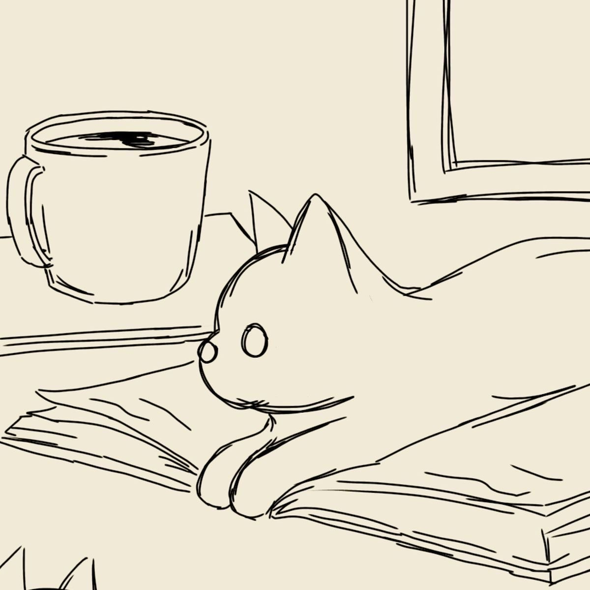

  

<pre>
    🎓 Computing student @ King Abdulaziz University
    💻 Learning Java • Python basics
    🤖 Interested in AI • Robotics • IoT
    🎨 Digital art • Games • Anime
    🐾 Cat lover • Curious about science &amp; space
</pre>

 

<!-- GIF source: https://tenor.com/view/sleepykitty-sleepy-kitty-pixel-cartoon-gif-5092247 -->

  

